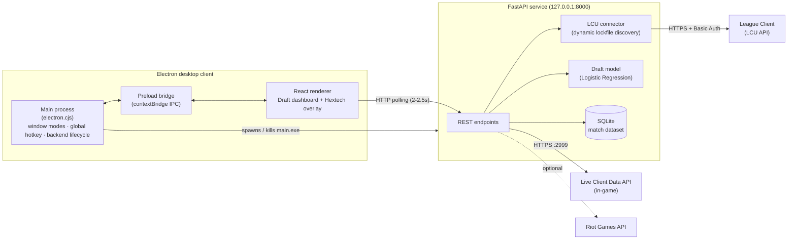

# LoL Live Overlay + Draft Assistant

> A Hextech-themed desktop companion for League of Legends: an ML-powered champion-select assistant and a low-latency, click-through in-game overlay that tracks your economy in real time.


---

## Table of Contents

- [Overview](#overview)
- [Architecture](#architecture)
- [Key Features](#key-features)
- [Tech Stack](#tech-stack)
- [Project Structure](#project-structure)
- [Prerequisites](#prerequisites)
- [Local Setup](#local-setup)
- [Running in Development](#running-in-development)
- [Production Build & Packaging](#production-build--packaging)
- [Configuration Reference](#configuration-reference)
- [API Reference](#api-reference)
- [Troubleshooting](#troubleshooting)
- [Legal](#legal)

---

## Overview

The app runs as a single transparent, always-on-top Electron window that **changes shape on its own as you move through a match**:

| Game phase | Window mode | What you see |
| --- | --- | --- |
| Client / Lobby / Champ Select | `PRE_MATCH`: 1200×800 interactive dashboard | Draft assistant: matchup win rates, item builds, ML pick recommendations |
| Loading screen / In game | `POST_MATCH`: fullscreen click-through overlay | Live CS/min, Gold/min, and an item progression guide drawn over the game |

It detects phase changes with no user input by polling the local League Client (LCU) API, and you can show or hide the overlay at any time with **`Ctrl + Shift + O`**. The hotkey uses a native OS-level keyboard hook, so it keeps working while the fullscreen game has focus.

## Architecture



**Backend: async polling service (Python / FastAPI)**
- Discovers the League Client at runtime by reading its `lockfile` (port + auth token). It finds the install via running-process inspection (`psutil`, then `wmic`, then PowerShell CIM), and falls back to scanning every drive letter for common install paths. It works with custom install locations and degrades gracefully on permission errors.
- Maps the LCU gameflow phase (`ChampSelect`, `InProgress`, …) to a simple status (`OFFLINE` / `LOBBY` / `ACTIVE` / `GAME`) that drives the UI.
- Queries the in-game **Live Client Data API** in parallel with a thread pool (`concurrent.futures`) to keep each poll fast.
- Serves draft recommendations from a scikit-learn model trained on a historical match dataset stored in SQLite.

**Desktop client: Electron + React (TypeScript)**
- Hardened renderer: `contextIsolation: true`, `nodeIntegration: false`, and a minimal whitelisted IPC surface exposed through `preload.cjs`.
- In production, launches the frozen backend (`main.exe`) as a hidden child process and terminates it on quit.
- Overlay panels are draggable and dismissible. The window ignores the mouse by default and only captures it while the cursor is over a panel, so your in-game clicks are never stolen.

## Key Features

- **Live economy tracking**: real-time **CS/min**, **Gold/min**, total CS, and total gold earned. Gold earned is computed as unspent gold plus the shop value of your current items, which is more accurate than reading current gold alone.
- **Item progression guide**: knows your champion's core build path, checks off completed items, and recommends the next purchase you can afford (or tells you how much more gold you need).
- **Real-time draft assistant**: reads champ select live and ranks the best available picks against the enemy composition using a trained Logistic Regression model.
- **Matchup analysis**: head-to-head win rate and the items most often built in winning games, from the SQLite match dataset.
- **Low-latency UI overlay**: transparent, frameless, click-through window that stays above fullscreen games and adapts to any monitor resolution.
- **Native global hotkey**: `Ctrl + Shift + O` through a low-level Windows keyboard hook. No AutoHotkey required.
- **Zero-config client detection**: finds the League install on any drive or custom path.
- **One-click installer**: frontend and Python backend are shipped together in a single NSIS installer.

## Tech Stack

| Layer | Technologies |
| --- | --- |
| Desktop shell | Electron 42, `node-global-key-listener`, electron-builder (NSIS) |
| Frontend | React 18, TypeScript 5, Vite 5, Tailwind CSS 3 |
| Backend | Python, FastAPI, Uvicorn, Requests, `psutil`, `python-dotenv` |
| Data / ML | scikit-learn, pandas, NumPy, SQLite |
| External APIs | League Client (LCU) API, Live Client Data API, Riot Data Dragon, Riot Games API (optional) |
| Packaging | PyInstaller (single-file backend), electron-builder |

## Project Structure

```text
.
├── .env.example                 # Template for all environment variables
├── lol-backend/                 # Python FastAPI service
│   ├── main.py                  # App entry point, REST endpoints, live-stats + item logic
│   ├── config.py                # Env/.env configuration loader
│   ├── lcu_connector.py         # Dynamic League lockfile discovery + LCU auth
│   ├── database_queries.py      # SQLite queries + ML recommendation inference
│   ├── scraper.py               # Riot Games API client (match history)
│   ├── database_setup_league.py # Builds league_database.db from data/league_data.xlsx
│   ├── train_model.py           # Trains draft_model.pkl / model_features.pkl
│   ├── main.spec                # PyInstaller build spec
│   └── requirements.txt
└── lol-draft-assistant/         # Electron + React desktop client
    ├── electron.cjs             # Electron main process
    ├── preload.cjs              # Secure contextBridge IPC
    ├── src/
    │   ├── main.tsx             # React entry point
    │   ├── App.tsx              # Phase routing, polling, draft dashboard
    │   ├── config.ts            # Frontend env config (API URL, Data Dragon patch)
    │   └── components/
    │       └── HextechOverlay.tsx  # In-game overlay panels
    ├── vite.config.ts
    └── package.json
```

## Prerequisites

- **Windows 10/11.** The global hotkey and League client detection are Windows-specific.
- **Node.js 18+** (developed on Node 24) and npm
- **Python 3.11+** (developed on Python 3.14)
- **League of Legends** installed, for live features
- *(Optional)* A **Riot Games API key** from the [Riot Developer Portal](https://developer.riotgames.com/), only needed for the match-history endpoint

## Local Setup

### 1. Clone the repository

```bash
git clone https://github.com/<your-username>/<your-repo>.git
cd <your-repo>
```

### 2. Configure environment variables

Copy the template to the repository root and edit it. The backend and the frontend both read this one file.

```powershell
Copy-Item .env.example .env
```

At minimum, check that `VITE_API_BASE_URL` matches `BACKEND_HOST`/`BACKEND_PORT`. Add `RIOT_API_KEY` only if you want the match-history endpoint. See the [Configuration Reference](#configuration-reference) for every key.

### 3. Backend: virtual environment and dependencies

```powershell
cd lol-backend
python -m venv venv
.\venv\Scripts\Activate.ps1        # macOS/Linux shells: source venv/bin/activate
python -m pip install --upgrade pip
pip install -r requirements.txt
```

> The repository ships with a pre-built `league_database.db` and trained model files. To rebuild them from `data/league_data.xlsx`, run:
> ```powershell
> python database_setup_league.py
> python train_model.py
> ```

### 4. Frontend: Node dependencies

```powershell
cd ..\lol-draft-assistant
npm install
```

> **PowerShell tip:** if you see `npm.ps1 cannot be loaded because running scripts is disabled`, run `npm.cmd install` instead (same for every `npm` command below).

## Running in Development

Use three terminals:

```powershell
# 1) Backend API (auto-reload)
cd lol-backend
.\venv\Scripts\Activate.ps1
uvicorn main:app --reload --host 127.0.0.1 --port 8000

# 2) Vite dev server
cd lol-draft-assistant
npm run dev

# 3) Electron shell (loads the Vite dev server)
cd lol-draft-assistant
npm run electron:dev
```

- Interactive API docs: <http://127.0.0.1:8000/docs>
- **Overlay design preview:** open <http://localhost:5173/?overlay=1> in a browser to see the in-game overlay without being in a match.
- For the `Ctrl + Shift + O` hotkey to work while League is focused, **launch the Electron terminal as Administrator**. The game runs elevated, and Windows blocks input hooks from lower-privileged processes.

## Production Build & Packaging

Packaging produces one Windows installer that contains both the React UI and the frozen Python backend.

### Step 1: Freeze the backend with PyInstaller

```powershell
cd lol-backend
.\venv\Scripts\Activate.ps1
python -m PyInstaller --clean main.spec
```

This outputs `lol-backend/dist/main.exe`: a single, console-less executable with the SQLite database and model files bundled inside.

### Step 2: Hand the backend to Electron

```powershell
New-Item -ItemType Directory -Force ..\lol-draft-assistant\assets\bin | Out-Null
Copy-Item dist\main.exe ..\lol-draft-assistant\assets\bin\main.exe -Force
```

electron-builder copies `assets/bin/main.exe` into the app's `resources/bin/` folder (see `build.extraResources` in `package.json`). The Electron main process launches it on startup.

### Step 3: Build the installer with electron-builder

```powershell
cd ..\lol-draft-assistant
npm run dist
```

This runs `tsc`, `vite build`, and `electron-builder` in order. The NSIS installer is written to `lol-draft-assistant/dist-desktop/`.

> **Notes**
> - `VITE_*` variables are **baked in at build time**. Set them in `.env` *before* running `npm run dist`.
> - The packaged backend reads runtime configuration from real environment variables, or from a `.env` file placed next to `main.exe` (`resources/bin/.env`).
> - Rebuild and re-copy `main.exe` whenever backend code changes.

## Configuration Reference

All keys live in the root `.env` (template: [`.env.example`](.env.example)).

| Variable | Used by | Default | Description |
| --- | --- | --- | --- |
| `RIOT_API_KEY` | Backend | *(empty)* | Riot Games API key. Only needed for `/api/live-history`. |
| `RIOT_PLATFORM` | Backend | `euw1` | Riot platform routing value. |
| `RIOT_REGION` | Backend | `europe` | Riot regional routing value. |
| `BACKEND_HOST` | Backend | `127.0.0.1` | Interface the API binds to. |
| `BACKEND_PORT` | Backend | `8000` | Port the API listens on. |
| `CORS_ORIGINS` | Backend | `http://localhost:5173` | Comma-separated allowed origins. |
| `LOG_LEVEL` | Backend | `INFO` | `DEBUG`, `INFO`, `WARNING`, or `ERROR`. |
| `VITE_API_BASE_URL` | Frontend | `http://127.0.0.1:8000` | Backend base URL used by the UI. |
| `VITE_DDRAGON_VERSION` | Frontend | `15.1.1` | Data Dragon patch for champion/item icons. |
| `ELECTRON_START_URL` | Electron (dev) | `http://localhost:5173` | Dev-server URL. Read from the shell environment. |

## API Reference

| Method | Endpoint | Description |
| --- | --- | --- |
| `GET` | `/` | Health check and version. |
| `GET` | `/api/live-client-draft?top_n=5` | Current client phase and, during champ select, both teams plus ML pick recommendations. |
| `GET` | `/api/live-match-stats` | In-game CS, gold, per-minute rates, game clock, and item progression. |
| `GET` | `/api/matchup-analysis?my_champ=&enemy_champ=` | Head-to-head win rate and winning item builds. |
| `GET` | `/api/team-recommendation?enemy_team=&ally_team=&top_n=5` | Ranked champion picks for a given composition. |
| `GET` | `/api/live-history?name=&tag=` | Latest match for a Riot ID (requires `RIOT_API_KEY`). |

## Troubleshooting

| Symptom | Fix |
| --- | --- |
| Hotkey does nothing while in game | Run the app as Administrator (see [Running in Development](#running-in-development)). |
| Blank or invisible window when running elevated | The Chromium sandbox is already disabled in `electron.cjs` for this reason. Make sure `preload.cjs` exists. |
| `WinKeyServer.exe` missing / hotkey fails to register | Windows Defender sometimes quarantines `node-global-key-listener`'s helper. Add a folder exclusion, then reinstall `node_modules`. |
| UI shows `OFFLINE` | The League client isn't running, or the backend isn't reachable at `VITE_API_BASE_URL`. |
| `Model not found` errors | Make sure `draft_model.pkl` and `model_features.pkl` exist, or regenerate them with `train_model.py`. |

## Legal

This project isn't endorsed by Riot Games and doesn't reflect the views or opinions of Riot Games or anyone officially involved in producing or managing Riot Games properties. Riot Games, and all associated properties are trademarks or registered trademarks of Riot Games, Inc.
